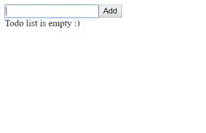
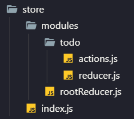

# Entendendo o Redux com hooks

Se você está agora por dentro do mundo do React já deve ter ouvido falar do termo Redux, mas a final o que é ele? Para que ser? Onde vive?

Vamos tentar responder algumas dessas perguntas nesse post.

# Quando usar o Redux

Vamos imaginar o seguinte caso, precisamos fazer com que um componente filho altere os dados de um componente pai.

Para isso vamos criar uma componente chamado **TodoList** e dentro dele vamos criar mais dois componentes chamados **Header** e **List** respetivamente.

_TodoList.js_

```js
import React, { useState } from 'react';
import Header from './Header';
import List from './List';

export default function TodoList() {
    const [list, setList] = useState([]);

    function onAdd(value) {
        setList([...list, value]);
    }

    function onRemove(index) {
        setList(list.filter((item, i) => i !== index));
    }

    return (
        <>
            <Header onAdd={onAdd} />
            <List list={list} onRemove={onRemove} />
        </>
    );
}
```

_Header.js_

```js
import React, { useState } from 'react';

export default function Header({ onAdd }) {
    const [value, setValue] = useState('');

    function handleAdd(e) {
        e.preventDefault();

        if (value.length > 0) {
            onAdd(value);
            setValue('');
        }
    }

    return (
        <form onSubmit={handleAdd}>
            <input type="text" value={value} onChange={e => setValue(e.target.value)} />
            <button type="submit">Add</button>
        </form>
    );
}
```

_List.js_

```js
import React from 'react';

export default function List({ list, onRemove }) {
    if (list.length === 0) {
        return <span>Todo list is empty :)</span>;
    }

    function handleRemove(index) {
        onRemove(index);
    }

    return (
        <ul>
            {list.map((item, index) => (
                <li key={index}>
                    <span>{item} </span>
                    <button type="button" onClick={() => handleRemove(index)}>
                        Remove
                    </button>
                </li>
            ))}
        </ul>
    );
}
```

O resultado será esse:



Como podemos ver acima, o componente **TodoList** tem um estado que é compartilhado com seus filhos. Para que eles possam alterar esse estado é passada uma função de **callback** via propriedades.

Agora digamos que, se os componentes filhos acima também tiverem outros componentes filhos que alterem o estado do **TodoList**, teríamos que ficar passando o callback de um filho para outro. Isso em um projeto grande acaba ficando complexo e de difícil manutenção com o tempo.

Caso o projeto atenda algum dos critérios abaixo, há uma grande possibilidade de ser preciso usar o redux:

-   Se o estado de um componente não tem "dono", ou seja, o estado é compartilhado por vários componentes.
-   Se o estado é manipulado por mais componentes.
-   Se as ações do usuário causam efeitos colaterais nos dados, ou seja, se essa ação pode causa um efeito que altere outros componentes.

Pronto, agora que vimos alguns critérios para quando usar o redux, vamos entender o que ele é.

# O que é o Redux

Redux é uma biblioteca que implementa a arquitetura **Flux** (_A arquitetura flux é uma formar de comunicação de vários elementos em tela_) e é usado como gerenciador de estados globais da aplicação. Podemos dividi-lo em 3 partes: **store**, **actions**, **reducers**.

### Store

O store é um **objeto JavaScript**. Podemos pensar nele como sendo o local onde irá ficar salvo o estado global da aplicação.

### Actions

Actions são responsáveis por solicitar a mudança de algo no **store**. Eles devem ser uma **função pura** e retornar um **objeto JavaScript**, esse objeto deve ter pelos menos um atributo **type** definido.

### Reducers

Reducers são responsáveis por receber as solicitações de mudança dos **actions** e alterar algum dado no store.

Agora iremos para a parte prática e adicionar o redux no nosso exemplo citado no começo do post.

# Configurando o Redux

#### Instalando o redux

Precisamos instalar duas dependências no nosso projeto: o **redux** e o **react-redux**. Para isso basta executar o comando abaixo no terminal:

```sh
yarn add redux react-redux
```

ou

```sh
npm i --save redux react-redux
```

#### Configurando o store, actions e redurces

Essa parte dá um pouco mais de trabalho, porém é a parte mais importante.

Começaremos criando uma pasta **store** e ela terá a seguinte estrutura:



-   **modules**: Nessa pasta irão ficar todos os módulos da nossa aplicação, que são um agrupamento de actions e reducers por entidade.

    -   **todo**: Nessa pasta irão ficar os arquivos de actions e reducers relacionados ao **todo**.

        -   **actions.js**: Arquivo com as actions do **todo**.
        -   **reducer.js**: Arquivo com o reducer do **todo**.

    -   **rootReducer.js**: Arquivo responsável por pegar os reducers de todos os módulos e combinar eles em um só.

-   **index.js**: Nesse arquivo vamos configurar o store da aplicação.

Vamos ver o conteúdo de cada arquivo acima.

_modules/todo/actions.js_

```js
export function addTodo(value) {
    return {
        type: '@todo/ADD_TODO',
        value
    };
}

export function removeTodo(index) {
    return {
        type: '@todo/REMOVE_TODO',
        index
    };
}
```

Aqui definimos e exportamos todos os actions relacionados à entidade **todo**. Como falamos anteriormente, eles devem ser funções puras e retornar um objeto javascript, que obrigatoriamente deve ter um atributo **type**.

_modules/todo/reducer.js_

```js
const initialState = [];

export default function todo(state = initialState, action) {
    switch (action.type) {
        case '@todo/ADD_TODO':
            return [...state, action.value];

        case '@todo/REMOVE_TODO':
            return state.filter((item, i) => i !== action.index);

        default:
            return state;
    }
}
```

No reducer exportamos apenas uma função, ela recebe o state atual e o action que foi disparado (é o mesmo objeto que retornamos nas funções do arquivo _actions.js_). Dentro da função do reducer fizemos um switch para saber qual o action que está sendo disparado naquele momento e retornamos um novo objeto com o state atualizado (não devemos alterar o objeto state direto, sempre precisamos criar um novo).

_modules/rootReducer.js_

```js
import { combineReducers } from 'redux';

import todo from './todo/reducer';

export default combineReducers({
    todo
});
```

Aqui usamos a função **combineReducers** do redux para combinar todos os nossos reducers em um objeto só. A medida que formos criando novos módulos, basta importarmos o reducer deles aqui e colocá-los dentro do objeto da função **combineReducers**.

_store/index.js_

```js
import { createStore } from 'redux';

import rootReducer from './modules/rootReducer';

export default createStore(rootReducer);
```

E por último usamos a função **createStore**, também do redux, para criarmos nosso store e passarmos para ela os nossos reducers do arquivo _rootReducer.js_.

Pronto, agora falta só conectar os nossos componentes.

#### Conectado os componentes no redux

Primeiro precisamos configurar o componente **Provider** do **react-redux** no nosso projeto. Esse componente deve ficar por volta de toda a aplicação e receber como propriedade o **store**. Para isso vamos criar um novo componente chamado **App** e colocar o **TodoList** dentro dele.

_App.js_

```js
import React from 'react';
import { Provider } from 'react-redux';

import TodoList from './components/TodoList';
import store from './store';

export default function App() {
    return (
        <Provider store={store}>
            <TodoList />
        </Provider>
    );
}
```

Podemos agora fazer uma pequena refatoração no componente **TodoList**

_TodoList.js_

```js
import React from 'react';
import Header from './Header';
import List from './List';

export default function TodoList() {
    return (
        <>
            <Header />
            <List />
        </>
    );
}
```

Aqui removemos todos aqueles callbacks e as propriedades que passávamos para os componentes filhos.

Vamos refatorar também os componentes **Header** e **List**.

_Header.js_

```js
import React, { useState } from 'react';
import { useDispatch } from 'react-redux'; // 👈

import { addTodo } from '../store/modules/todo/actions'; // 👈

export default function Header() {
    const dispatch = useDispatch(); // 👈
    const [value, setValue] = useState('');

    function handleAdd(e) {
        e.preventDefault();

        if (value.length > 0) {
            dispatch(addTodo(value)); // 👈
            setValue('');
        }
    }

    return (
        <form onSubmit={handleAdd}>
            <input type="text" value={value} onChange={e => setValue(e.target.value)} />
            <button type="submit">Add</button>
        </form>
    );
}
```

_List.js_

```js
import React from 'react';
import { useDispatch, useSelector } from 'react-redux'; // 👈

import { removeTodo } from '../store/modules/todo/actions'; // 👈

export default function List() {
    const dispatch = useDispatch(); // 👈
    const list = useSelector(state => state.todo); // 👈

    if (list.length === 0) {
        return <span>Todo list is empty :)</span>;
    }

    function handleRemove(index) {
        dispatch(removeTodo(index)); // 👈
    }

    return (
        <ul>
            {list.map((item, index) => (
                <li key={index}>
                    <span>{item} </span>
                    <button type="button" onClick={() => handleRemove(index)}>
                        Remove
                    </button>
                </li>
            ))}
        </ul>
    );
}
```

Aqui estamos usando dois hooks do react-redux, o **useDispatch** e o **useSelector**.

-   **useDispatch**: Esse hook retorna uma função que iremos usar quando quisermos disparar uma ação para os reducers, enviando como parâmetro um **action**.
-   **useSelector**: Iremos usar esse hook quando quisermos ler algum dado do store. Passaremos para ele uma função que recebe como parâmetro o estado atual e então retornar a propriedade que estamos buscando.

# Conclusão

Embora pareça um pouco complexo e verboso no começo, o redux facilita muito na comunicação de vários componentes e uma vez que o seu entendimento seja alcançado, terá um aumento de produtividade considerável.

Espero que tenha dado para entender um pouco sobre como o redux funciona.

Todo o código usado no exemplo está disponível nesse repositório.
